# Leonies Lernwelt

Eine kleine Lern-App für Kinder im Grundschulalter, gemacht für das Tablet. Sie läuft
einfach im Browser – ohne Installation, ohne Konto, ohne Werbung.

Die Module sind nach Schulfächern sortiert – Leonies Idee: Jeder **Lernbereich** ist eine
eigene Süßigkeit. Das erste Modul heißt **„Die Uhr“** (Mathe): Leonie (8) lernt damit, die
Zeigeruhr zu lesen. In Deutsch übt **„Der, die, das“** Nomen mit bestimmtem und unbestimmtem
Artikel. Weitere Module folgen.

**Ausprobieren:** [lernwelt.nieda.de](https://lernwelt.nieda.de)

<p align="center">
  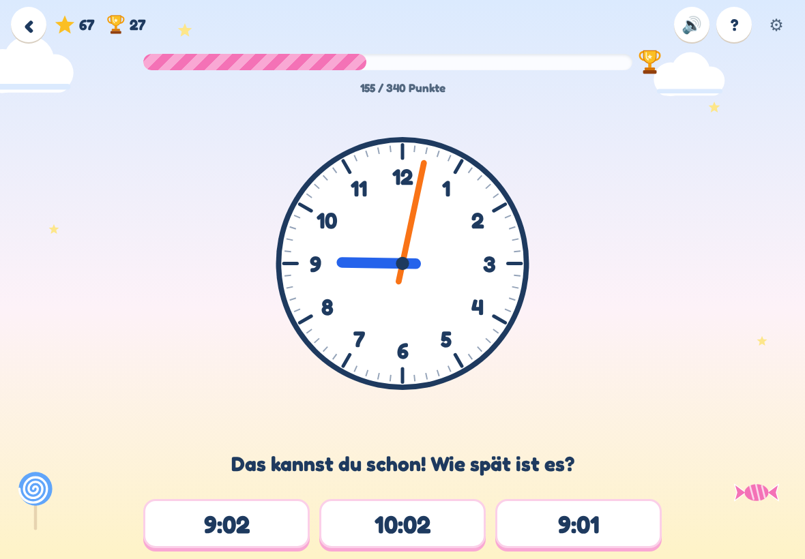
</p>

## Die Idee

Die Uhr lesen ist für viele Kinder schwer: zwei Zeiger, zwölf Zahlen, sechzig Striche –
und dann heißt 3:30 auch noch „halb vier“. Die App übt das in kleinen Schritten und mit
vielen Wiederholungen statt mit Prüfungen:

- In der Mitte steht immer eine **große Zeigeruhr** mit den Zahlen 1 bis 12.
- Darunter gibt es **drei Antworten** zum Antippen. Eine davon stimmt.
- Wer richtig tippt, bekommt **Punkte**, sammelt **Sterne** und füllt seinen
  **Zuckerstangen-Balken** bis zum **Pokal**.
- Fehler kosten nichts. Die App erklärt in Ruhe, was die Zeiger zeigen, und bringt die
  Uhrzeit ein paar Aufgaben später noch einmal.

## Auf Tablet und Handy

Gemacht für das Tablet, läuft aber genauso auf dem Handy – im Hoch- und im Querformat. Die Uhr
nimmt immer den Platz ein, der übrig bleibt; auf dem Handy quer stehen Uhr und Antworten
nebeneinander.

**Als App installieren:** Auf Android-Tablets und -Handys erscheint auf der Startseite der Knopf
„Installieren“ (sonst im Chrome-Menü „App installieren“). Danach liegt Leonies Lernwelt mit
eigenem Icon auf dem Startbildschirm, öffnet im Vollbild ohne Adressleiste und funktioniert
auch ohne Internet. Auf dem iPad: Teilen → „Zum Home-Bildschirm“.

<p align="center">
  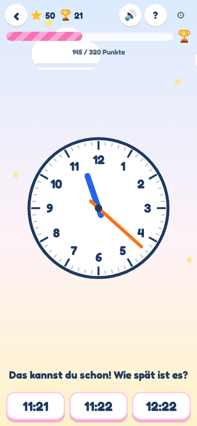
  &nbsp;
  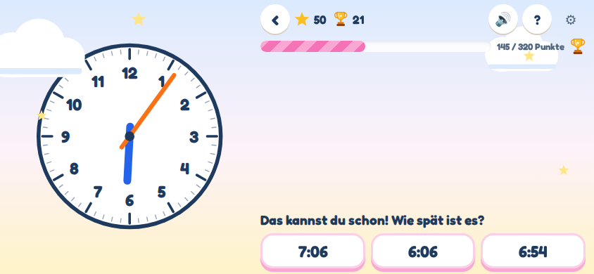
</p>

## Lernbereiche

| Bereich | Süßigkeit | Module |
|---|---|---|
| Mathe | Lolli | Die Uhr |
| Deutsch | Bonbon | Der, die, das |
| Musik | Cupcake | folgt |
| HSU – Heimat- und Sachunterricht | Gummibärchen | folgt |
| Englisch | Schokolade | folgt |

Auf der Startseite wählt man zuerst den Bereich, dann das Modul. Ein grünes Schild
**„Hier weiter“** zeigt immer genau eine Empfehlung – zum Beispiel einen angefangenen
Durchgang fortsetzen, Fehler von neulich wiederholen oder nach ein paar Tagen Pause
auffrischen. Kleine Bonbons zeigen, wie viele Stufen eines Moduls schon sicher sitzen.

<p align="center">
  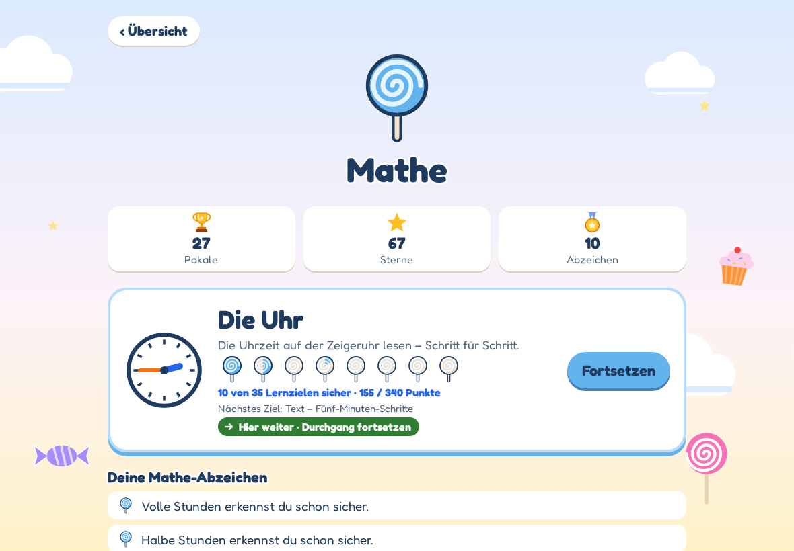
</p>

## So lernt man mit der App

### Sechs Stufen – von leicht nach schwer

| Stufe | Uhrzeiten | Punkte |
|:-:|---|:-:|
| 1 | volle Stunden – 3:00 | 10 |
| 2 | halbe Stunden – 3:30 | 15 |
| 3 | Viertelstunden – 3:15 und 3:45 | 20 |
| 4 | 3:10, 3:20, 3:40, 3:50 | 25 |
| 5 | Fünf-Minuten-Schritte – 3:05, 3:25, 3:35, 3:55 | 30 |
| 6 | einzelne Minuten – 3:07, 3:52 … | 40 |

Wie schnell es weitergeht, entscheidet allein das Können – nicht der Kalender. Jede Stufe
sammelt **Lernpunkte**: +10 für jede richtige Antwort (+5 extra, wenn sie flott kam – eine
Uhr oder einen Zeitdruck sieht das Kind nie), −10 für einen Fehler. Bei **60 Lernpunkten**
und richtigen Antworten auf verschiedene Uhrzeiten geht es zur nächsten Stufe – wer alles
richtig macht, also schon nach vier bis sechs Aufgaben. Die neue Stufe startet mit zwei
erklärten Beispielen und kommt dann immer öfter dran (40 % bis 75 % der Aufgaben).
Zwischendurch kommen leichte Uhrzeiten – „Das kannst du schon!“.

**Aufwärmen:** An einem neuen Tag kommen zuerst ein paar Uhrzeiten aus früheren Stufen,
die schwächeren häufiger. Sitzen sie, geht es sofort mit der aktuellen Stufe weiter; ein
Fehler verlängert das Aufwärmen um eine Aufgabe.

### Uhrzeiten in Worten

Sobald eine Stufe geschafft ist, kommen dieselben Uhrzeiten auch **in Worten**: „Viertel nach zehn“, „halb vier“, „zehn vor
drei“. Diese Aufgaben sind eingestreut und bringen 5 Bonuspunkte. Ein Lautsprecher-Knopf
liest die Antworten vor.

Später kommt als Zusatzlektion, wie man es in vielen Regionen sagt: **„fünf vor halb vier“**
(3:25), „fünf nach halb vier“ (3:35), „zehn vor halb vier“ (3:20) und „zehn nach halb vier“
(3:40) – jeweils mit zwei erklärten Beispielen: „Bis halb vier fehlen noch fünf Minuten.“

<p align="center">
  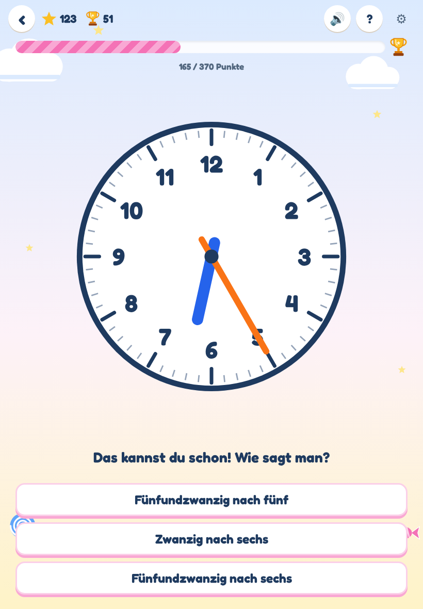
  &nbsp;
  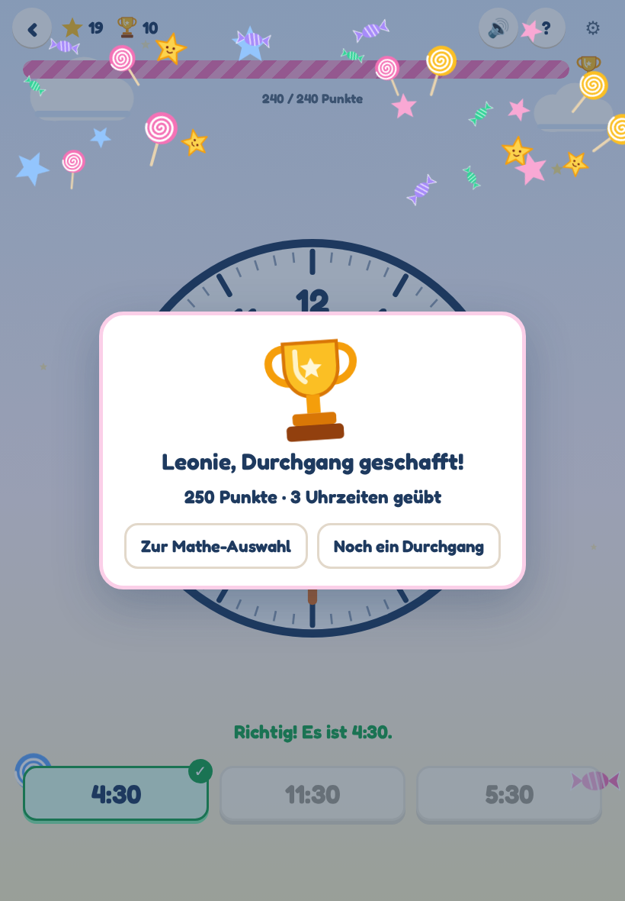
</p>

### Zeiger stellen und Uhrzeit eintippen

Zuschauen ist leichter als selbst machen – deshalb gibt es zwei weitere Arten zu üben:

- **Zeiger stellen:** Die Uhrzeit wird vorgegeben, als „12:30“ oder in Worten („Viertel vor
  elf“). Beide Zeiger haben einen Griff zum Ziehen. Wie bei einer echten Uhr läuft der kurze
  Zeiger mit, wenn man den langen über die 12 zieht. Die Zeiger rasten passend zur Stufe ein
  – erst auf volle Stunden, später auf halbe, Viertel, Fünfer und einzelne Minuten.
- **Uhrzeit eintippen:** Die Uhr wird gezeigt, die Uhrzeit wird über eine große
  Zifferntastatur eingetippt, z. B. „11:23“. Ohne Tageszeit sind 11:23 und 23:23 beide
  richtig – die App zeigt dann, wie man es üblicherweise schreibt.

Beides kommt nacheinander dazu, sobald die jeweilige Stufe beim Ablesen sitzt, und bringt
10 Bonuspunkte. Nach einem Fehler gibt es wieder genau einen Hinweis, etwa „Der lange Zeiger
gehört auf die 9“ oder „Zähle vom Zwölferstrich: zwanzig, einundzwanzig, zweiundzwanzig …“.

<p align="center">
  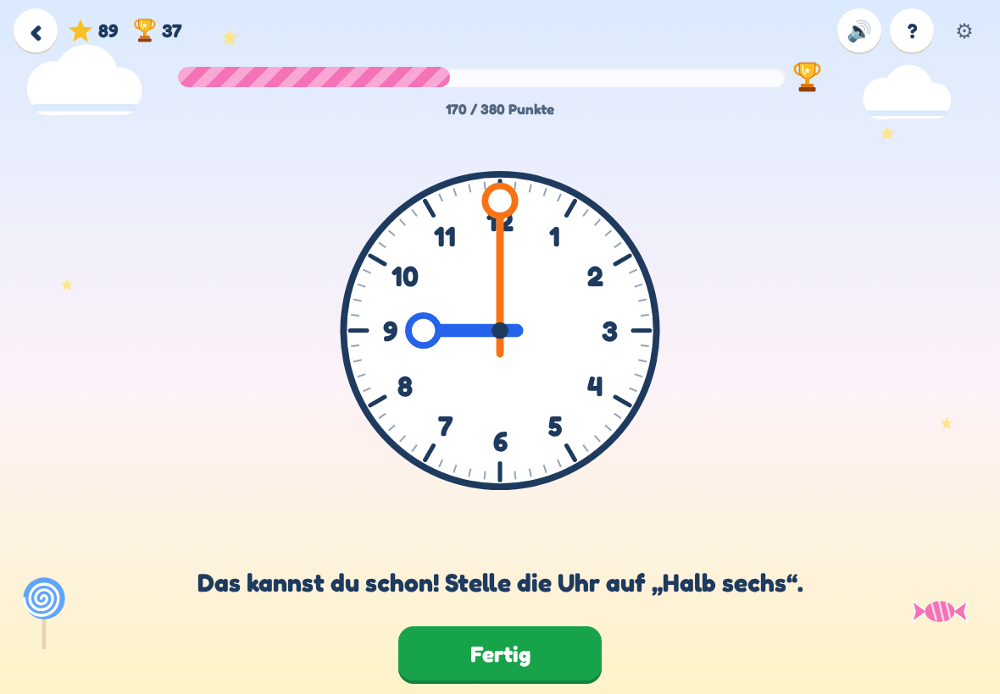
  &nbsp;
  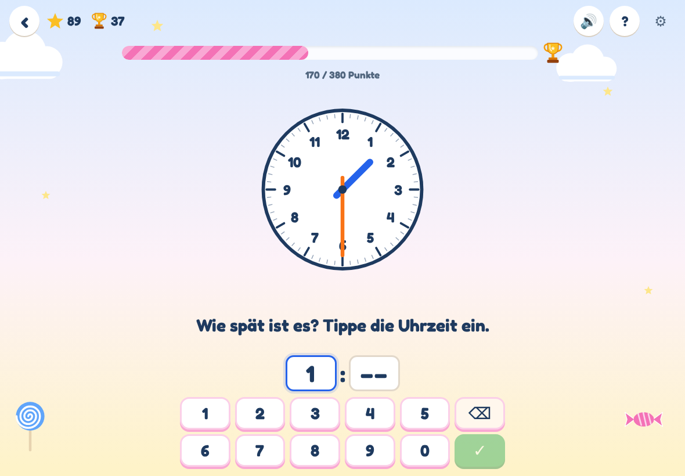
</p>

### Tageszeiten

Eine Zeigeruhr sieht um 3 Uhr morgens genauso aus wie um 3 Uhr nachmittags. Sobald halbe
Stunden geschafft sind, steht deshalb bei manchen Aufgaben neben der Uhr, welche Tageszeit
es ist – mit Bild: zuerst **„Es ist Nachmittag.“** (13 bis 18 Uhr), später auch
**Vormittag**, **Abend**, **Mittag** und **„kurz nach Mitternacht“**. Dann ist die Antwort
zum Beispiel **21:30 Uhr – halb zehn am Abend** oder **0:15 Uhr – Viertel nach zwölf in der
Nacht**. In etwa jeder zweiten Aufgabe ist dieselbe Uhr in der anderen Tageshälfte eine der
falschen Antworten – so lernt das Kind, auf die Tageszeit zu achten: „Nach zwölf Uhr mittags
zählen wir weiter: dreizehn, vierzehn, fünfzehn …“

Danach wird selbst umgerechnet, in beide Richtungen (je volle, halbe und Viertelstunden,
15 Bonuspunkte):

- **Zeiger stellen nach 24-Stunden-Zeit:** „Stelle die Uhr auf 21:30.“ Erst zurückrechnen
  (21 − 12 = 9), dann halb zehn stellen. Die Tageszeit verrät die App hier erst in den
  Beispielen, auf Hilfe und nach der Antwort.
- **Eintippen mit Tageszeit:** Die Uhr zeigt halb zehn, daneben „Es ist Abend.“ – richtig ist
  nur 21:30. Bei 9:30 heißt es: „Du hast die Uhr richtig abgelesen. Am Abend zählen wir nach
  zwölf weiter: 9 + 12 = 21.“

Nachmittag und Abend kommen dabei häufiger dran, Vormittag, Mittag und Mitternacht bleiben
als Gegenprobe, damit „zwölf dazu“ nicht zur Gewohnheit wird.

<p align="center">
  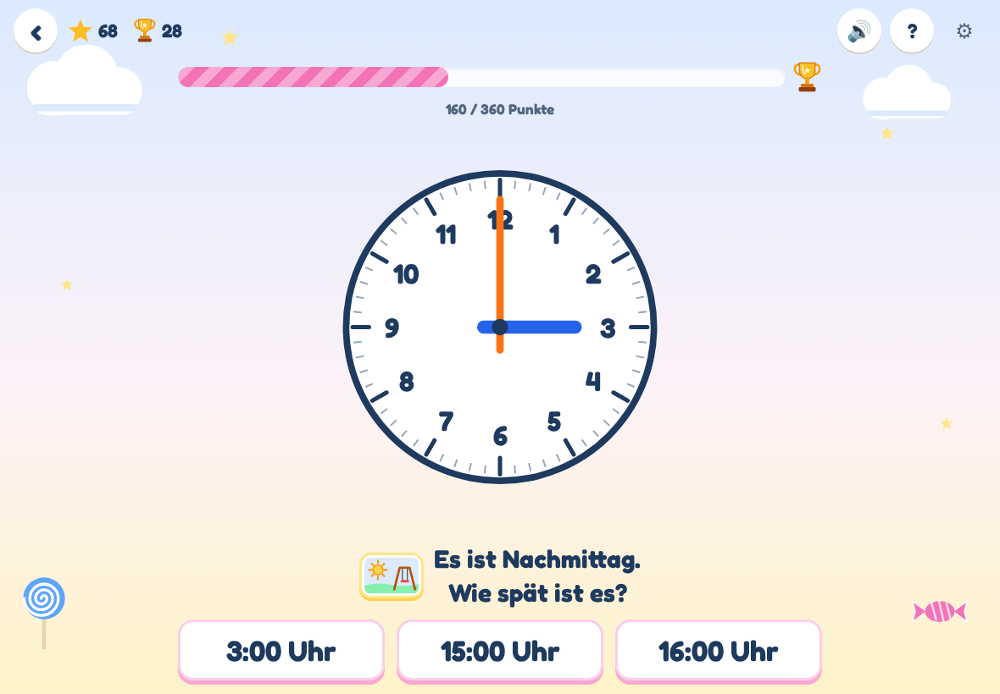
</p>

### Erst sagen, dann aufdecken

Bei Uhrzeiten, die schon sicher sitzen, sind die Antworten ab und zu erst einmal verdeckt:
„Sag die Uhrzeit laut. Dann tippe auf ‚Aufdecken‘.“ Selbst erinnern festigt mehr als
Wiedererkennen. Im Elternbereich lässt sich das abschalten.

### Durchgänge, Pokale, Sterne und Abzeichen

- Ein **Durchgang** endet, wenn der Punkte-Balken voll ist. Das Ziel passt sich dem
  Können an: am Anfang 100 Punkte, später mehr – so dauert ein Durchgang immer etwa
  zehn richtige Antworten. Am Ende gibt es **immer einen Pokal**, egal wie viele Fehler
  dabei waren.
- Für je fünf richtige Antworten gibt es einen **Stern**.
- Wenn eine Stufe sicher sitzt, gibt es ein **Abzeichen**, z. B. „Halbe Stunden erkennst
  du schon sicher.“
- Drei richtige Antworten hintereinander werden kurz gefeiert.

### Hilfe, wenn es hakt

- Der **?-Knopf** blendet Hilfen an der Uhr ein: Minutenzahlen außen (05, 10, 15 …),
  farbige Viertel und den Bereich, in dem der Stundenzeiger steht. Mit Hilfe gelöste
  Aufgaben bringen halbe Punkte.
- Nach einem Fehler erklärt die App genau **einen** Punkt, passend zum Fehler – zum
  Beispiel: „Der kurze Zeiger ist noch nicht bei der 4. Die Stunde ist noch 3.“
- Bei zwei Fehlern hintereinander kommt ein Beispiel und eine leichte Aufgabe, nach drei
  Fehlern ein freundliches Pausenangebot.
- Die falschen Antworten sind keine Zufallszahlen, sondern typische Verwechslungen
  (Stunde zu früh gelesen, Viertel nach / Viertel vor vertauscht …). So lernt das Kind
  genau das, was oft schiefgeht.

<p align="center">
  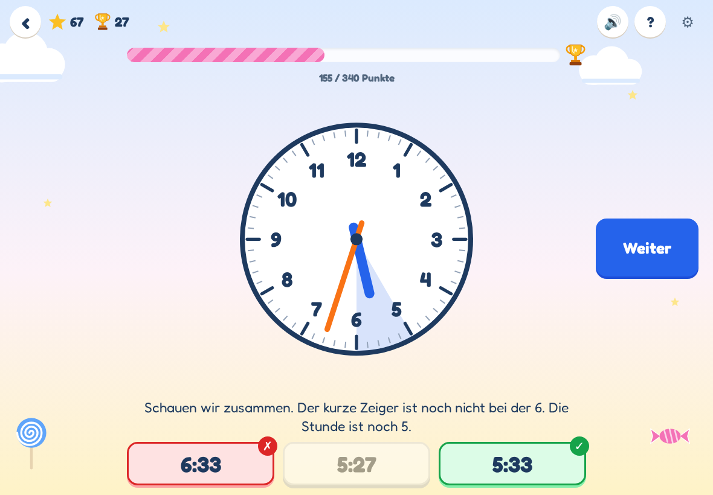
</p>

### Spielstand: „Wer lernt hier?“

Beim ersten Start fragt die App nach einem **Namen und einer PIN aus vier Ziffern**. Damit
liegt der Spielstand auf dem Server und ist auf jedem Gerät da – auf dem Tablet zu Hause
genauso wie auf dem Handy unterwegs. Wer schon geübt hat, nimmt seinen Stand beim Anlegen
des Profils mit.

- Gespeichert wird nur der Lernstand (Stufen, Punkte, Sterne, Pokale) – keine weiteren
  Daten. Die PIN liegt nur als Hash auf dem Server.
- Nach fünf falschen PINs ist das Profil für 15 Minuten gesperrt; so lässt sich die PIN
  nicht durchprobieren.
- Die App funktioniert auch offline; Änderungen werden hochgeladen, sobald wieder Internet
  da ist. Spielt jemand auf zwei Geräten, gewinnt die spätere Änderung.
- Wer das nicht möchte: „Ohne Anmeldung spielen“ – dann bleibt alles nur auf dem Gerät.
- **Profil löschen** (unten auf der Startseite, mit PIN) entfernt Profil und Spielstand
  sofort vom Server. Was wo gespeichert wird, steht im
  [Datenschutzhinweis](datenschutz.html).

<p align="center">
  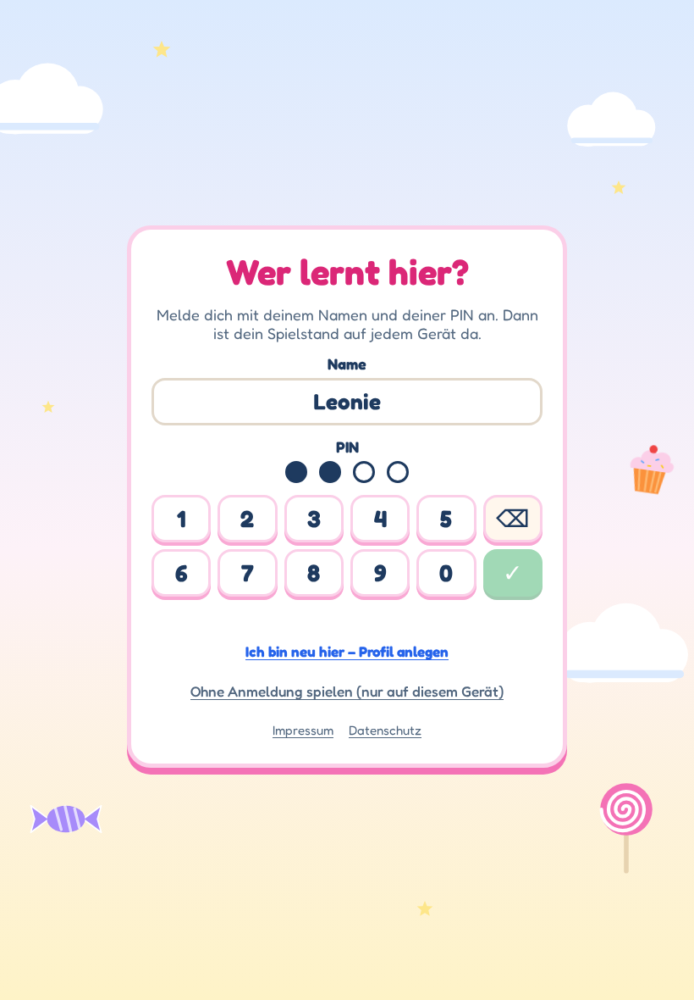
</p>

### Für Eltern

- Auf der **Startseite** sieht man alle Pokale, Sterne und Abzeichen und die Lernbereiche,
  unten das Profil, ob der Spielstand gespeichert ist, und die **Version** der App.
- Das **Zahnrad** im Uhr-Modul öffnet den Elternbereich: Stand jeder Stufe und Spur,
  Töne an/aus, „Erst sagen, dann aufdecken“ an/aus und „Fortschritt löschen“ (drei
  Sekunden gedrückt halten).
- **Updates:** Die installierte App sucht beim Start, alle 30 Minuten und beim Zurückkehren
  nach einer neuen Version und lädt sie, sobald gerade keine Übung läuft. Ein Tipp auf die
  Versionsnummer sucht sofort.
- Tipp: Kurze Übungsrunden von fünf bis zehn Minuten wirken besser als lange.

<p align="center">
  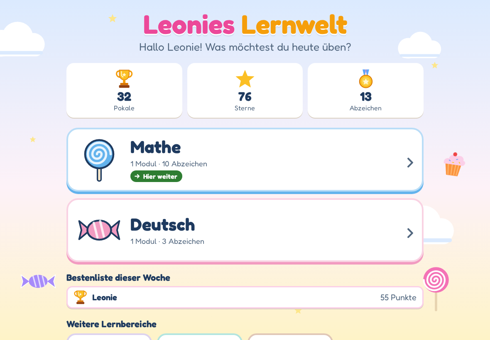
</p>

## Deutsch: Der, die, das

Das erste Deutsch-Modul folgt den Schulbuchseiten zu bestimmtem und unbestimmtem Artikel.
Beim Artikel-Wählen und in den Mini-Geschichten steht das Wort mit einem Bild auf einer
Karte; beim Nomen-Entdecken gibt es kein Bild, weil es die Lösung verraten würde. Der
Artikel wird immer zusammen mit dem Nomen gelernt („der Igel“), denn eine Regel zum Raten
gibt es nicht.

| Stufe | Aufgabe | Beispiel |
|:-:|---|---|
| 1 | der, die oder das? | ___ Igel → der |
| 2 | ein oder eine? | der Igel → ein Igel (am Anfang mit „der Igel“ als Brücke) |
| 3 | Nomen entdecken | Ist TISCH ein Nomen? Später: Tippe auf das Nomen im Satz. |
| 4 | Kennen wir es schon? | Schau, da ist eine Ente. ___ Ente ist schön. → die |

Fehler ziehen keine Lernpunkte ab, und es gibt keinen Tempo-Bonus – Lesen braucht Zeit.
Ein Durchgang hat immer zehn Übungsaufgaben; die erklärten Beispiele zu einer neuen Stufe
zählen nicht mit. Sicher (mit Abzeichen) ist eine Stufe erst, wenn sie auch in einer
späteren Übungsrunde – nach mehr als einer halben Stunde Pause – noch klappt. Sterne, Pokale, Wochenpunkte, Hilfe und
Vorlesen funktionieren wie bei der Uhr.

<p align="center">
  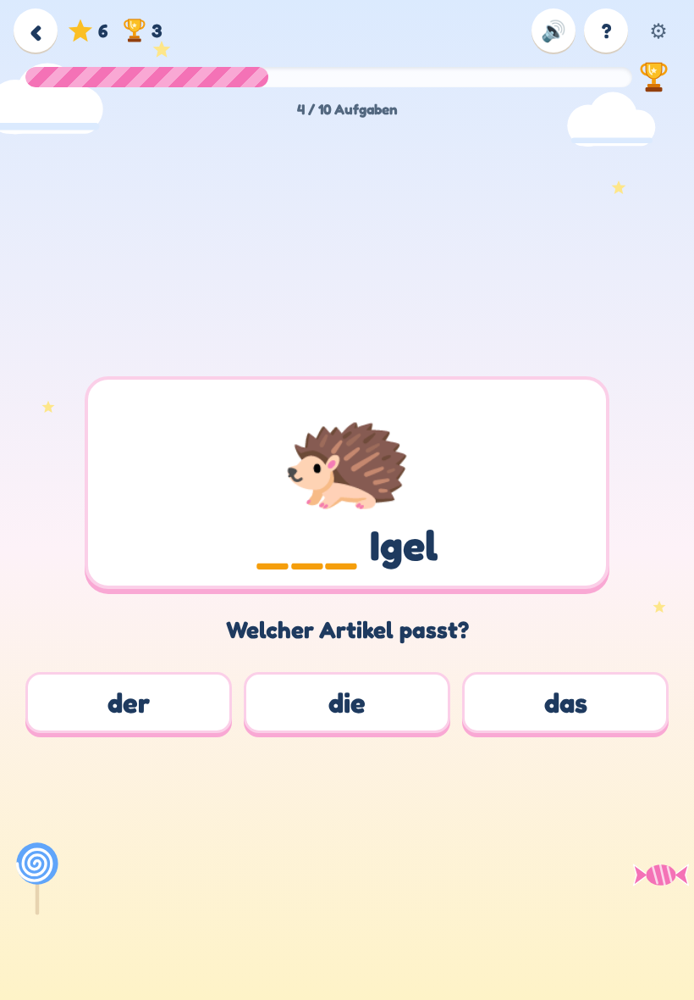
  &nbsp;
  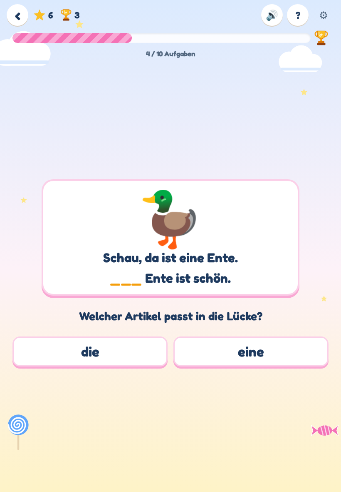
</p>

## Ideen für später

Gesammelt im [Backlog](BACKLOG.md) – zum Beispiel Zeitspannen („Wie lange noch?“), weitere
Module und eine Taschengeld-Idee.

---

## Technik

Für alle, die mitbauen möchten.

- **Vite + TypeScript**, kein Framework. Die Uhr ist ein SVG.
- Die Lernlogik (Stufen, Freischaltung, Anteile, Wiederholungen, Punkte) steckt in
  [`src/modules/clock/engine.ts`](src/modules/clock/engine.ts) und ist mit **Vitest**
  getestet.
- Fortschritt liegt im `localStorage` des Browsers und wird mit dem eigenen kleinen
  **API-Server** ([`server/src`](server/src), Node ohne Framework, JSON-Dateien) synchronisiert.
  Profile: Name + 4-stellige PIN (scrypt), Geräte-Token, Rate-Limits.
- Installierbar als **PWA** (Vollbild, offline, automatische Updates).
- Die Schrift [Fredoka](https://fonts.google.com/specimen/Fredoka) ist eingebettet
  (kein Abruf bei Google).
- Neue Module implementieren `LearningModule` aus
  [`src/modules/types.ts`](src/modules/types.ts) und werden in ihrem Lernbereich in
  [`src/areas.ts`](src/areas.ts) eingetragen.

```bash
npm install
npm run api        # API auf :8081 (Daten in .data/), der Dev-Server leitet /api dorthin
npm run dev        # http://localhost:5173, im WLAN auch vom Tablet erreichbar
npm test           # Unit-Tests
npm run build      # statische Seite in dist/
```

Screenshots für diese README neu erzeugen (Dev-Server muss laufen; nutzt Playwright):

```bash
npx playwright install chromium   # einmalig
node scripts/screenshots.mjs http://localhost:5173
```

Der angezeigte Titel („Patricks Lernwelt“) entsteht in [`src/config.ts`](src/config.ts) aus
dem Profilnamen.
Das Deployment (Docker + Terraform) beschreibt [`DEPLOY.md`](DEPLOY.md).

## Lizenz

[MIT](LICENSE)
